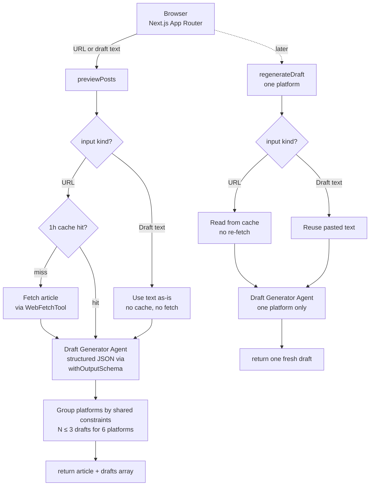

<div align="center">
  
  <h1>Blog to Social Posts</h1>
  <b>Turn blog posts into platform-optimized social media posts</b>
  <br/>
  <i>Next.js • Multi-agent • Six writer-focused platforms</i>
  <br/><br/>
  <i>Built by <a href="https://links.timonwa.com">Timonwa</a> with <a href="https://adk.iqai.com/">ADK-TS</a></i>
  <br/><br/>

<a href="./LICENSE"></a>
<a href="./CONTRIBUTING.md"></a>
<a href="https://tech.timonwa.com/code-of-conduct"></a>
<a href="https://nextjs.org"></a>
<a href="https://www.typescriptlang.org"></a>
<a href="https://biomejs.dev"></a>
<a href="https://buymeacoffee.com/timonwa"></a>
</div>

---

Paste a published blog URL **or drop in an unpublished draft** (up to ~2,500 words). Blog to Social Posts reads it, drafts posts for **X, LinkedIn, Threads, Bluesky, Mastodon, and Substack Notes** in the tone you pick, and lets you edit, copy, and share — all from one page.

**Open-source tool for writers who want to share their articles everywhere — published or not.**

## Features

- **URL or draft** — paste a published article URL, or drop in an unpublished draft (up to ~2,500 words / 15k chars). Live character counter.
- **6 platforms writers actually use** — text-first, where sharing your articles fits naturally (see platform groups below).
- **X threads** — generate a thread of any length, with a per-post preview and per-post char counter.
- **Editable drafts** — tweak content inline before copying. Live character counter against each platform's limit.
- **Regenerate per draft** — don't like the X post but love the LinkedIn one? Regenerate just that one (URL mode hits the article cache, so regenerate is fast + cheap).
- **Auto tone** — the agent picks a platform-appropriate tone by default, or force professional / casual / educational / punchy across all.
- **Writing preferences** — voice (I / we / third-person), emoji density, hashtag density. Applied to every draft.
- **Hashtag rules** — always include or never use specific tags. Universal, enforced in-prompt.
- **Preset templates** — save a named snapshot of tone + platforms + prefs. One click to reapply. The active template is highlighted; hover shows what's inside.
- **Workflow memory** — tone, platforms, thread length, prefs, templates, and hashtag rules all survive page reloads.
- **Local history** — up to 10 recent generations (URLs _and_ drafts) stored in your browser. Click to restore, click Remove to forget.
- **URL on copy, not in draft** — the agent keeps article URLs out of the draft text so you can use CTA phrases like "Read more ↓". When you hit Copy, the URL gets appended automatically.
- **Article preview card** — title and author extracted from the fetched article (URL mode), with the source link. Draft mode marks the card as "Unpublished draft" instead.
- **Article cache (URL mode)** — fetched articles are cached server-side for 1 hour. Regenerating drafts doesn't re-fetch.
- **Copy all** — grab every draft, labeled per platform, in one click.
- **BYOK** — paste your own Google AI Studio key in Settings to use your own Gemini quota. Key lives in your browser's sessionStorage only — never on our servers.
- **Token-efficient** — platforms are grouped by shared constraints. Worst case: 3 LLM drafts cover all 6 platforms.

## Platform groups (token optimization)

The agent uses an explicit map to dedup content across similar platforms:

| Group             | Platforms                   | Char limit | Style                                             |
| ----------------- | --------------------------- | ---------- | ------------------------------------------------- |
| short-casual      | X, Bluesky                  | 280        | Punchy hook + CTA. 2-3 hashtags. Casual.          |
| medium-community  | Threads, Mastodon, Substack | 500        | Community-oriented, conversational. 0-2 hashtags. |
| long-professional | LinkedIn                    | 3000       | Professional framing, detailed. 3-5 hashtags.     |

Selecting X + Bluesky? → 1 draft generated, shown on both cards.
Selecting all 6? → 3 drafts generated, distributed to 6 cards.

## How it works



Writing preferences, hashtag rules, and the active template's settings are folded into the agent prompt at request time. The draft runner is cached as a singleton on the server so it's not rebuilt on every request.

## Design notes

- **Copy-only by design** — this tool drafts, you publish. No OAuth, no platform credentials, no MCP servers. If you want auto-publish, fork and add it.
- **Structured output** — the draft generator uses `withOutputSchema` from ADK-TS to return strongly typed JSON. A retry plugin also catches flaky web fetches.
- **URLs live outside the draft** — the agent is instructed to use CTA phrases ("Read more ↓") but never the literal URL. The client appends the URL on copy. Keeps the draft text clean and keeps your X char-budget accurate.
- **URL article cache, no draft cache** — fetched articles sit in server memory for an hour, keyed by URL, so regenerate is cheap. Pasted draft text is never cached server-side — it only exists for the lifetime of the request.
- **Workflow persistence** — the form's tone, platforms, thread length, writing preferences, hashtag rules, templates, and history are all persisted to your browser's localStorage, so the tool comes back the way you left it.
- **Active template detection** — on reload, if the restored state matches a saved template, it's automatically highlighted as active. Any manual knob-tweak clears the highlight.
- **Availability-driven BYOK** — when the hosted instance's rate limit is near, a pill in the navbar links straight to the Settings drawer and scrolls to the key input.

## Privacy

Written for writers who may be pasting unpublished work. TL;DR:

- **Your BYOK key** lives in your browser's **sessionStorage** and is cleared when the tab closes. Never stored on our servers.
- **Pasted draft text** is only sent to the LLM provider (Google Gemini) for that single request. Not cached server-side, not logged.
- **Fetched article content** (URL mode only) is cached in server memory for up to 1 hour so regenerate is fast. The article was already public.
- **Your local history, preferences, templates, hashtag rules, and workflow state** live only in your browser's localStorage. Clear browser data and they're gone.
- **Rate-limit counters** (hosted instance) store a SHA-256 hash of your IP + a daily counter in Upstash Redis. Resets at UTC midnight. BYOK requests skip this entirely.
- **No accounts, no profiles, no cross-session tracking.** The hosted instance uses [Cloudflare Web Analytics](https://www.cloudflare.com/web-analytics/) (cookieless, no cross-site tracking) if configured.

Full details: [tech.timonwa.com/privacy](https://tech.timonwa.com/privacy).

## Prerequisites

- Node.js ≥ 22
- pnpm
- Google AI API key ([aistudio.google.com/api-keys](https://aistudio.google.com/api-keys))

## Quick start

```bash
pnpm install
cp .env.example .env
# Edit .env — only GOOGLE_API_KEY is required.
pnpm dev
```

Open [http://localhost:3000](http://localhost:3000), paste a blog URL (or your draft), pick tone + platforms, and click **Generate drafts**.

## Environment variables

**Required:**

| Variable         | Purpose               |
| ---------------- | --------------------- |
| `GOOGLE_API_KEY` | Powers the Gemini LLM |

**Optional:**

| Variable                                 | Default            | Purpose                                                         |
| ---------------------------------------- | ------------------ | --------------------------------------------------------------- |
| `LLM_MODEL`                              | `gemini-2.5-flash` | LLM to use                                                      |
| `ADK_DEBUG`                              | `false`            | Verbose agent logs                                              |
| `UPSTASH_REDIS_REST_URL`                 | _(empty)_          | Hosted rate limiting. When absent, rate limits aren't enforced. |
| `UPSTASH_REDIS_REST_TOKEN`               | _(empty)_          | Pair of the above.                                              |
| `NEXT_PUBLIC_CLOUDFLARE_ANALYTICS_TOKEN` | _(empty)_          | Cloudflare Web Analytics beacon token. Leave blank to disable.  |

## Scripts

| Command          | What it does                   |
| ---------------- | ------------------------------ |
| `pnpm dev`       | Next.js dev server (Turbopack) |
| `pnpm build`     | Production build               |
| `pnpm start`     | Start the production server    |
| `pnpm format`    | Run Biome formatter            |
| `pnpm lint`      | Run Biome linter               |
| `pnpm check`     | Format + apply safe lint fixes |
| `pnpm typecheck` | TypeScript `--noEmit`          |

A `pre-commit` hook runs `biome format --write` on staged files via `husky` + `lint-staged`.

## Project structure

```text
src/
├── agents/
│   ├── coordinator/agent.ts              # getDraftRunner
│   └── draft-generator/                  # Agent + web-fetch cache plugin
├── app/                                  # Next.js App Router (layout, page,
│                                         # globals, opengraph-image, twitter-image)
├── components/
│   ├── _shared/                          # UI primitives (button, card, drawer, input, textarea…)
│   ├── layout/                           # navbar, footer, hero, hosted-usage-notice, tools-menu
│   ├── settings/                         # BYOK + writing prefs + hashtag rules drawer
│   ├── theme/                            # theme toggle + picker
│   └── writer/                           # generate-form, draft-card, history-sidebar,
│                                         # article-card, templates-picker, platform/tone pickers
├── constants/                            # platforms, tones, models, hosted-usage,
│                                         # preferences, draft-input, tools
├── hooks/                                # use-writer, use-history, use-theme
├── lib/
│   ├── actions.ts                        # Server actions (previewPosts, regenerateDraft)
│   └── rate-limit.ts                     # Upstash-backed daily rate limits
├── utils/                                # cn, draft helpers, storage
└── types.ts                              # Platform / Tone / Draft / WritingPreferences / PresetTemplate
```

## Limitations

- **Text only** — no image uploads. The preview card shows article metadata but doesn't attach images to posts.
- **Copy, don't publish** — you handle the actual posting manually. By design.
- **No paywalls** — can't read articles behind login walls.
- **No analytics on your drafts** — doesn't track how your posts perform after you publish them.

## Contributing

Bug reports, small UX improvements, agent-prompt refinements, and platform tweaks are all welcome. See [CONTRIBUTING.md](./CONTRIBUTING.md) for dev setup, scope guidance, and PR workflow.

By participating, you agree to the [Code of Conduct](https://tech.timonwa.com/code-of-conduct).

## Security

Found a vulnerability? **Do not** open a public issue.

- Report privately via [GitHub Security Advisories](https://github.com/Timonwa/tools-by-timonwa/security/advisories/new).
- Or email [me[@]timonwa[dot]com](mailto:me@timonwa.com?subject=Security%20vulnerability%20in%20tools-by-timonwa).

## License

MIT — see [LICENSE](./LICENSE). You're free to fork, modify, self-host, and use commercially.

## Support the project

If this tool saves you time, consider:

- ⭐️ [Starring the repo](https://github.com/Timonwa/tools-by-timonwa) once public
- ☕️ [Buying me a coffee](https://buymeacoffee.com/timonwa)
- 🛠 [Sponsoring on GitHub](https://github.com/sponsors/Timonwa)
- 🤝 Contributing code or docs

## Learn more

- [ADK-TS docs](https://adk.iqai.com/)
- [ADK-TS plugins](https://adk.iqai.com/docs/framework/plugins)

---

**Built by [Timonwa](https://links.timonwa.com) with [ADK-TS](https://adk.iqai.com/). Open source · MIT.**
